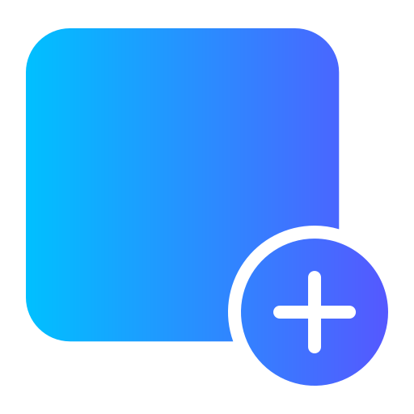

# Universal Tabs Manager - UTM

A simple, clean and powerful tabs manager for your browser.

> This project is still in its early stage.


## The Problem

As tech lovers and future software pros, we're into daily searches and online browsing. But, things can get a bit much when we end up with tons of tabs and tasks, causing our computer to slow down or even freeze.

Suddenly, our tab bar gets messy, and it's easy to get lost while jumping around. We end up with a bunch of tabs that don't even relate to what we're working on.

## Our Solution

Imagine having the ability to create distinct sessions for your tabs. Picture being able to group tabs within each session and set rules like snoozing tabs after a while or hiding entire groups to keep your tab bar clean and organized.

Envision the convenience of syncing your configured sessions and groups across various browsers and operating systems. And that's where our project, UTM (Universal Tabs Manager), comes into play—born out of the need for a solution to streamline and organize your browsing experience.

## Key Features

###  Managing New Tabs

 **New Tab Page** - UTM replaces your new tab page with a beautiful and customizable page that helps you stay focused and productive:
- **Clock** - Get the current time in your local timezone to keep tracking your day.
- **Hadeeth of the Day** - Read a new random `Hadeeth Shareef` every time you open a new tab in Arabic and English with reference information in `Sahih Al-Bukhari`.
- **Quick Access Links** - Access your most visited websites and bookmarks with a single click.
- **Todo List** - Create a todo list and manage your tasks.
- **Wallpapers** - Get beautiful wallpapers and customize it as you like through settings.

> Soon extra features and a show video will be added.

## Technologies:

- [Firefox Browser Extension Docs](https://developer.mozilla.org/en-US/docs/Mozilla/Add-ons/WebExtensions)
- [Typescript](https://www.typescriptlang.org/)
- [ReactJS](https://react.dev/)
- [Vite](https://vitejs.dev/)
- [TailWindCSS](https://tailwindcss.com/)
- [ESLint](https://eslint.org/)
- [Hadeeth API](https://github.com/fawazahmed0/hadith-api)
- [FontAwesome-Icons](https://fontawesome.com/)

## Used Media And Copy Rights
- Wallpapers from [WallHaven](https://wallhaven.cc/w/jxd1x5)
  > Also soon we will implement the API, So users can select and change the wallpaper by just some clicking from settings dialog.
- Default Quick Link icon from [FlatIcon](https://www.flaticon.com/free-icon/link_7471685?term=link&page=1&position=54&origin=search&related_id=7471685)
- Extension Logo from [Freepik](https://www.freepik.com/icon/user-interface_7580043#fromView=search&term=new+tab+plus&page=1&position=36&track=ais&uuid=692b2c7e-baf7-40b9-ab5a-6e945f3c5973)

## Installation

We will deploy the extension on the firefox store soon when it be ready for production release.

For now you can install it manually by building from source on your own by following the steps below or by downloading the latest release from github.

### Building From Source

- You need [Node.js](https://nodejs.org/en/download/current) if you don't have it already.

- Clone this repository

  ```bash
  $ git clone --depth=1 https://github.com/Davenchy/utm.git
  ```

- Install dependencies and start the building process.

  ```bash
  npm install
  npm run build
  ```

- A new directory is created `/dist` that contains the extension files.

# Add The Extension Manually To Firefox

- Go to `about:debugging#/runtime/this-firefox` then click on `Load Temporary Add-on...` button.


- Then select the manifest file `/dist/manifest.json`.
- After that you will find the extension in the extensions list during your current session.


# Debugging

- First you need to start the Vite development server.

    ```bash
    npm run dev
    ```
    
- Then you can run a separated browser instance for debugging
  or you can install it manual as shown above but you will need to manually reload the extension after each code update
  while the next npm scripts will do it for you after each code update.

```bash
# Start a firefox instance with the extension installed.
$ npm run browser

# Also you can open the instance with developer tools for debugging.
$ npm run browser:dev

# You can also set the path to the browser binary
npm run browser -- --firefox /path/to/firefox

# Also you can run the extension on chromium based browsers (still not fully supported yet and contains bugs)
# You can contribute here <3.
npm run browser -- --chromium-binary /path/to/any/chromium_based_browser
```

## Contributing

Your contribution is always welcome and appreciated. Go down to the Authors section and contact any of us to get started.

Also feel free to fork and add your awesome features to UTM, at the end it's your extension anyway <3.

## License

[MIT License](https://choosealicense.com/licenses/mit/)

## Authors

- Fadi Assad: [Github](https://github.com/Davenchy) - [Linkedin](https://www.linkedin.com/in/fadi-asaad/)
- Ammar Khaled: [Github](https://github.com/Ammar-Khaled) - [Linkedin](https://www.linkedin.com/in/ammar-khaled-895aa823b/)
- Ahmed Mamdouh: [Github](https://github.com/Ahmed-D007A) - [Linkedin](https://www.linkedin.com/in/ahmed-mamdouh-884805261/)
